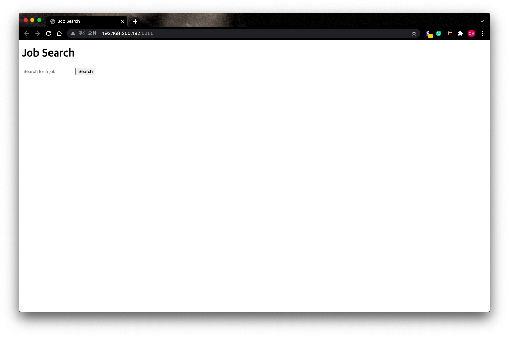
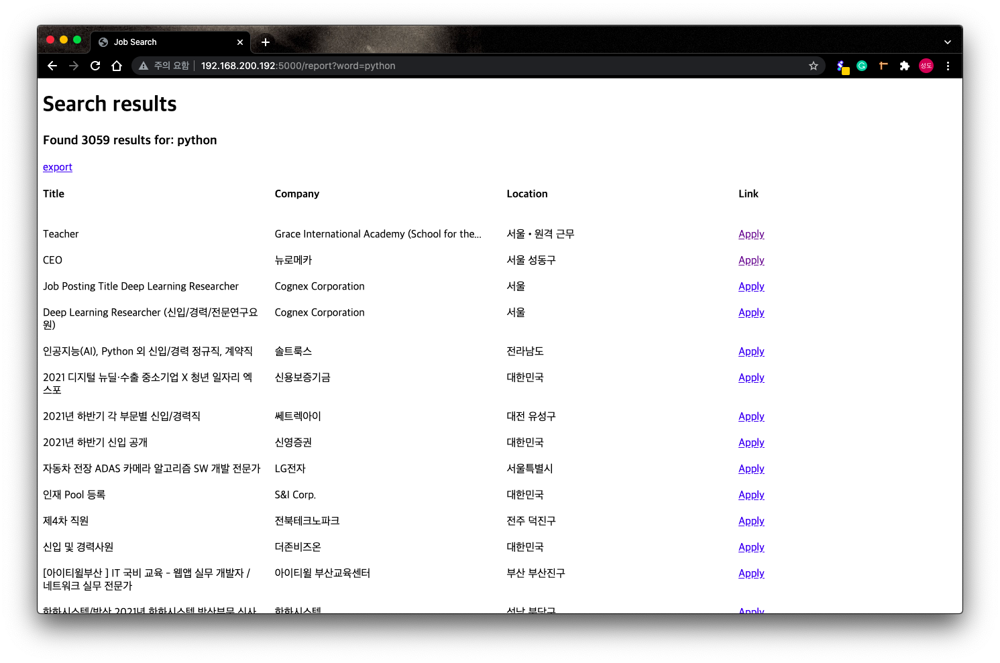
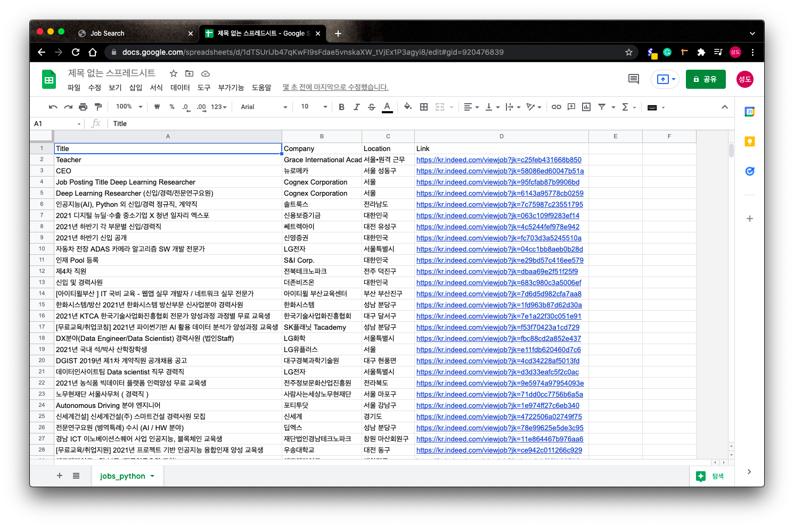

# Web-Scrapper

> [초급]Python으로 웹 스크래퍼 만들기<br/> - [NomadCoders](https://www.nomadcoders.co)

기초적인 Python 문법강의부터 시작하여 웹사이트의 html파일에서 원하는 내용을 Scrapping해서 출력, csv 파일로 저장, flask를 이용한 간단한 웹페이지 및 fakedb를 구축하는 방법을 배우는 코스입니다. django를 시작하기 전 간단히 설명해주는 강의가 포함되어 있습니다.

※ 주의사항 : indeed 사이트에서 가끔 캡챠에 걸려서 에러가 발생할 때가 있음...

## 사용 기술

- Python
- html

## 진도

- [x] 파이썬 기초 강의
- [x] Indeed에서 구직정보 추출하기
- [x] StackOverflow에서 구직정보 추출하기
- [x] CSV파일로 저장하기
- [x] Flask를 이용하여 웹사이트에서 정보 주고 받기
- [x] 사용자에게 입력값을 받아 Scrapping하기
- [x] Fake DB 만들기
- [x] 웹사이트에 구직정보 렌더링하기
- [x] CSV파일로 저장하기 기능 구현
- [x] 최종 결과물 업데이트

## 결과물

- index.html
  
- 검색어 입력시 나타나는 report.html
  
- export 선택 시 저장되는 csv파일
  

## 강의에서 배운 Tips

- import를 이용해 패키지 또는 다른 파일의 함수를 사용할 수 있다.
- from을 이용해 원하는 함수만 가져올 수 있다.
- as를 이용해 함수의 이름을 바꿀 수 있다.

```python
import 패키지
from 패키지 import 함수
from 패키지 import 함수 as 다른 이름
```

- 문자열에 변수 집어넣기 : f"variable name : {변수 이름}"
- urllib3보다 requests가 더 사용하기 편하다.
- [BeautifulSoup](https://www.crummy.com/software/BeautifulSoup/bs4/doc/)를 이용하여 HTML문서에서 원하는 데이터에 간편하게 접근할 수 있다.
- list[-1]은 list의 마지막 요소를 가리킨다. list[0:-1] 또는 list[:-1]은 list의 첫번째부터 마지막 전까지를 나타낸다.(마지막 요소를 제외한 모든 요소)<br/>[]안의 -1은 'len(list)-1'로 추정된다.(개인적인 생각)
- csv 파일로 저장하기

```python
import csv

file = open("파일명.csv", mode="w")
writer = csv.writer(file)
writer.writerow(["내용", "내용", "내용", ..., "내용"])
```

- Flask 사용하기

```python
app = Flask("앱이름")

@app.route("/")           # 기본주소(주로 index.html)
def 함수이름():             # @app.route("주소") 다음에 오는 함수에 주소 적용!
  return html형식          # return 값에 html형식으로 문자열을 입력하거나
@app.route("/기타주소")
def 함수이름():
  return render_template("파일이름.html") # 외부 html을 render_template을 사용해 불러올 수 있음.
@app.route("/<변수이름>")  # 주소에서 변수를 받아오면
def 함수이름(변수이름):      # 함수에서 매개변수로 사용해야함(안 하면 오류 발생)
  return html형식
                          # 이떄 기본 주소는 http://0.0.0.0/여야 하는데
app.run(host="0.0.0.0")   # 터미널에 * Running on http://192.168.###.###:5000/
                          # 라고 뜨면서 저 주소로 접속해야 html이 나타남
```

- Query arguments : http://주소/###?단어=단어&단어=단어... 에서 ? 뒤에 나오는 긴 문자열
- Flask를 통해 html에서 파이썬 이용하기
  - render_template("파일명.html", 변수 이름 = 변수)를 통해 html파일로 변수를 넘길 수 있다. html에서는 {{변수 이름}}으로 사용 가능하다.
  - html에서 python 문법은 으로 사용 가능하다.<br/>※ 주의! : 꼭 ,  등으로 끝났음을 나타내야한다.

```html
<!-- 변수 사용은 이렇게! -->
<h1>Hi {{Name}}~</h1>
<section>
  <!-- 문법 사용은 이렇게! -->
  
  <span>{{n}}번째 span<br /></span>
  
  <!-- 꼭 닫아주기! -->
</section>
```

- css grid에 대해 더 배우고 싶으면 css master 강좌 수강하기

## 기타

- package 확인하기

```sh
$ pip show 'package-name'
```

- package 설치하기

```sh
$ pip install 'package-name'
```

- 다른 환경에서 작업할 일이 많을 경우 requirements.txt로 패키지를 관리하면 편리하다.<br/>(이름을 꼭 저걸로 할 필요는 없으나 대부분 저 이름으로 관리)

```sh
#파일 생성
$ pip freeze > requirements.txt

#패키지 설치
$ pip install -r requirements.txt
```
